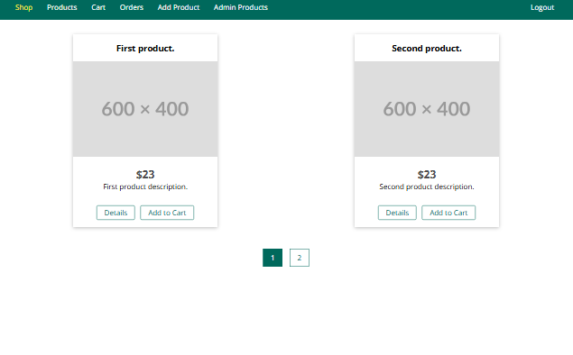

# Node E-Commerce Sample

## Introduction

Welcome to the **Node E-Commerce Sample**! This is a fully functional e-commerce platform built with **Node.js**, **Express**, and **MongoDB**. The project is designed to provide all the core functionalities needed for any e-commerce website, including product listings, user authentication, shopping cart management, order processing, and more.

The application uses **server-side rendering** for views, which ensures that the user experience is fast, SEO-friendly, and works well with both modern browsers and search engines.

## Preview

## Features

- **User Authentication**: Allow users to register, log in, and manage their accounts securely.
- **Shopping Cart**: Users can add items to their cart, modify quantities, and view the total price.
- **Order Processing**: Handle the checkout process and order management.
- **Admin Panel**: Admin users can manage products, orders, and user information.
- **Responsive Layout**: The application is designed to work well across both desktop and mobile devices.
- **Email Notifications**: Send order confirmation and other important notifications to users.

## Technologies Used

- **Node.js**: JavaScript runtime for building the server-side of the application.
- **Express.js**: Web framework for building APIs and handling HTTP requests.
- **MongoDB**: NoSQL database for storing user data, products, and order information.
- **EJS**: Templating engine for rendering HTML views on the server side.
- **Bcrypt**: For securely hashing user passwords before storing them in the database.
- **Nodemailer**: For sending email notifications to users (order confirmations, etc.).
